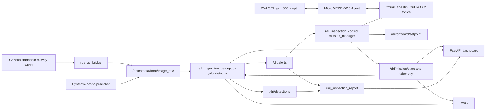

# Architecture

## Topic Contract

Core project topics:

- `/dri/drone/telemetry` (`ddrone_msgs/DroneTelemetry`)
- `/dri/mission/state` (`ddrone_msgs/MissionState`)
- `/dri/offboard/setpoint` (`geometry_msgs/PoseStamped`)
- `/dri/camera/front/image_raw` (`sensor_msgs/Image`)
- `/dri/camera/down/image_raw` (`sensor_msgs/Image`)
- `/dri/detections` (`ddrone_msgs/Detection`)
- `/dri/alerts` (`ddrone_msgs/Alert`)
- `/dri/perception/debug_image` (`sensor_msgs/Image`)
- `/dri/mission/path` (`nav_msgs/Path`)
- `/dri/mission/markers` (`visualization_msgs/MarkerArray`)

PX4 integration topics when `px4_msgs` is available:

- `/fmu/in/offboard_control_mode`
- `/fmu/in/trajectory_setpoint`
- `/fmu/in/vehicle_command`

## Mission Flow

1. Take off from corridor staging pad.
2. Enter railway corridor.
3. Fly parallel to the double-track route.
4. Detect anomaly.
5. Slow and generate reinspection setpoint.
6. Publish alert and evidence.
7. Continue inspection.
8. Return and land.

## RL Extension Point

`rail_inspection_rl.env.RailInspectionEnv` is a Gymnasium skeleton. It defines observation and action spaces for later connection to ROS2/Gazebo adapters:

- Observation: pose, velocity, last detection vector, mission progress.
- Action: velocity-like forward/lateral/vertical command.
- Adapter: `RulePolicyAdapter` demonstrates replacing the rule mission manager with a policy boundary.
