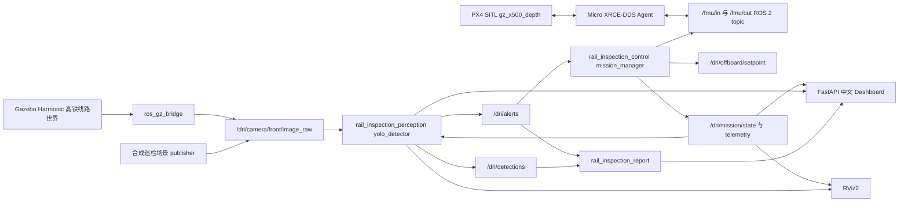

# 架构说明

## 设计原则

项目把仿真、感知、任务、展示和报告拆成相对独立的 ROS 2 包：

- Gazebo/PX4 负责飞行和场景仿真。
- `rail_inspection_control` 负责巡检流程和 offboard setpoint。
- `rail_inspection_perception` 负责图像输入、YOLO/fallback 检测、告警和 debug image。
- `rail_inspection_report` 负责结构化报告，不依赖 Gazebo。
- `rail_inspection_dashboard` 只消费 `/dri/*` 业务 topic 和报告文件，便于后续替换为真实数据源。
- `rail_inspection_rl` 预留 Gymnasium 和 policy 接口，不强行耦合到第一阶段演示链路。

这个边界的目标是：第一阶段能稳定演示，后续能替换真实相机、真实 PX4 链路、真实 YOLO 模型或 RL policy，而不重写 Dashboard 和报告系统。

## 运行模式

| 模式 | 启动命令 | 主要用途 |
| --- | --- | --- |
| 离线工程演示 | `.\scripts\start_offline_demo.ps1` | 快速验证 ROS 2 业务链路、检测、告警、Dashboard 和报告，不等待 PX4/Gazebo |
| 完整仿真 | `.\scripts\start_full_sim.ps1 -NoRviz -CleanBuild` | 验证 PX4 SITL、Gazebo、uXRCE-DDS、ROS 2 bridge 和业务链路 |
| 带 RViz 仿真 | `.\scripts\start_full_sim.ps1 -CleanBuild` | 在 WSLg/X11 可用时查看轨迹、marker、debug image 和关键 topic |
| 本地报告 smoke | `python .\scripts\report_smoke.py` | 不启动 ROS/Docker，仅验证中文报告模板和证据路径 |

## Topic 合约

核心业务 topic：

- `/dri/drone/telemetry` (`ddrone_msgs/DroneTelemetry`)
- `/dri/mission/state` (`ddrone_msgs/MissionState`)
- `/dri/offboard/setpoint` (`geometry_msgs/PoseStamped`)
- `/dri/camera/front/image_raw` (`sensor_msgs/Image`)
- `/dri/camera/down/image_raw` (`sensor_msgs/Image`)
- `/dri/detections` (`ddrone_msgs/Detection`)
- `/dri/alerts` (`ddrone_msgs/Alert`)
- `/dri/perception/debug_image` (`sensor_msgs/Image`)
- `/dri/mission/path` (`nav_msgs/Path`)
- `/dri/mission/markers` (`visualization_msgs/MarkerArray`)

完整 PX4 仿真中还会出现：

- `/fmu/in/offboard_control_mode`
- `/fmu/in/trajectory_setpoint`
- `/fmu/in/vehicle_command`
- `/fmu/out/vehicle_local_position`

`/dri/*` 是项目自己的业务抽象；`/fmu/*` 是 PX4 bridge 侧 topic。后续真实无人机迁移时，应尽量保持 `/dri/*` 不变，只替换底层适配器和传感器驱动。

## 任务流程

1. 从线路旁 staging pad 起飞。
2. 进入高铁线路走廊。
3. 沿双线轨道方向巡检。
4. 感知节点发现异常目标。
5. 任务管理器减速并进入复查阶段。
6. 生成复查 setpoint，靠近异常区域。
7. 检测节点发布告警和证据路径。
8. 报告节点写入 JSON/Markdown/HTML。
9. Dashboard 实时展示任务、检测、告警和报告入口。
10. 任务继续巡检，最后返航降落。

## 感知与报告链路

检测节点按以下优先级运行：

1. `data/models/rail_defects.pt`
2. `data/models/yolov8n.pt`
3. synthetic fallback detector

fallback detector 的作用是让工程演示和验收在没有真实 YOLO 权重、没有网络、没有 GPU 推理环境时仍然可重复。真实检测能力应通过训练或微调 `rail_defects.pt` 获得。

报告链路消费 `/dri/alerts`、`/dri/detections`、`/dri/drone/telemetry` 和 `/dri/mission/state`，输出：

- `data/reports/inspection_report.json`
- `data/reports/inspection_report.md`
- `data/reports/inspection_report.html`
- `data/evidence/*`

中文报告模板位于 `rail_inspection_report/report_templates.py`，可用 `python .\scripts\report_smoke.py` 独立验证。

## RL 扩展点

`rail_inspection_rl.env.RailInspectionEnv` 是 Gymnasium 骨架，当前定义了后续接入 ROS 2/Gazebo adapter 所需的基础接口：

- observation：无人机位姿、速度、最近检测向量、任务进度。
- action：前向/横向/垂向速度类控制输入。
- reward：预留覆盖率、目标复查质量、碰撞、越界和能耗指标。
- adapter：`RulePolicyAdapter` 演示如何把规则任务管理器替换为 policy 边界。

后续可把 `mission_manager` 的规则 setpoint 替换成 RL policy 输出，同时保留告警、报告和 Dashboard。

## 真实无人机迁移边界

真实部署时建议保留：

- `/dri/mission/state`
- `/dri/drone/telemetry`
- `/dri/camera/front/image_raw`
- `/dri/detections`
- `/dri/alerts`
- 报告 JSON/Markdown/HTML schema
- Dashboard API

需要替换：

- Gazebo camera publisher -> 真实相机 driver
- 仿真 pose/GPS/IMU -> PX4 EKF、GPS/RTK、IMU 和里程坐标适配器
- PX4 SITL -> 真实 PX4 飞控 + companion computer
- fallback detector -> 真实训练的 `rail_defects.pt`、ONNX 或 TensorRT engine
- 简化安全策略 -> 地理围栏、低电量返航、失联返航、人工接管和 HITL 回归
